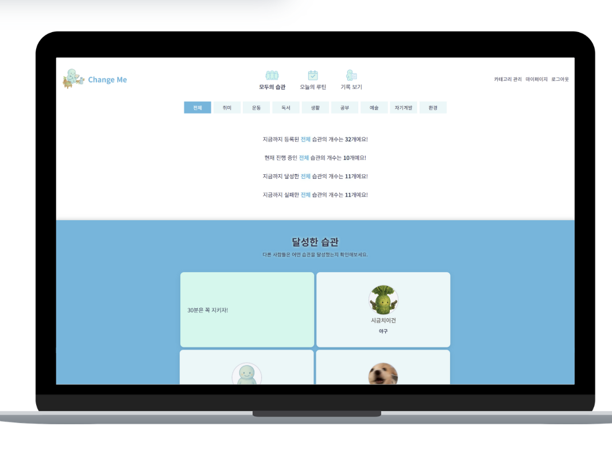
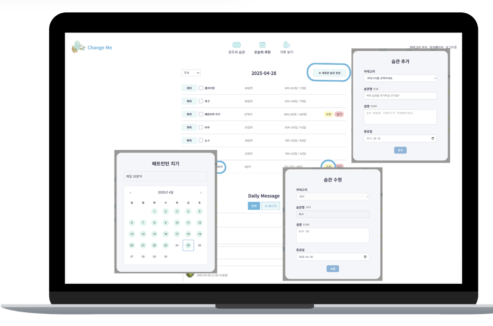
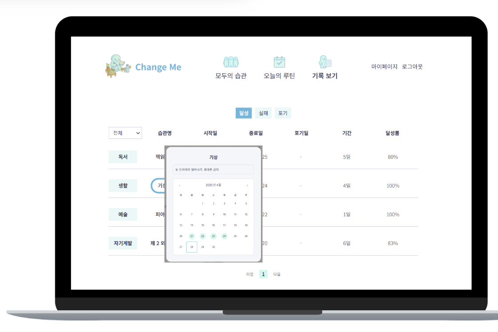
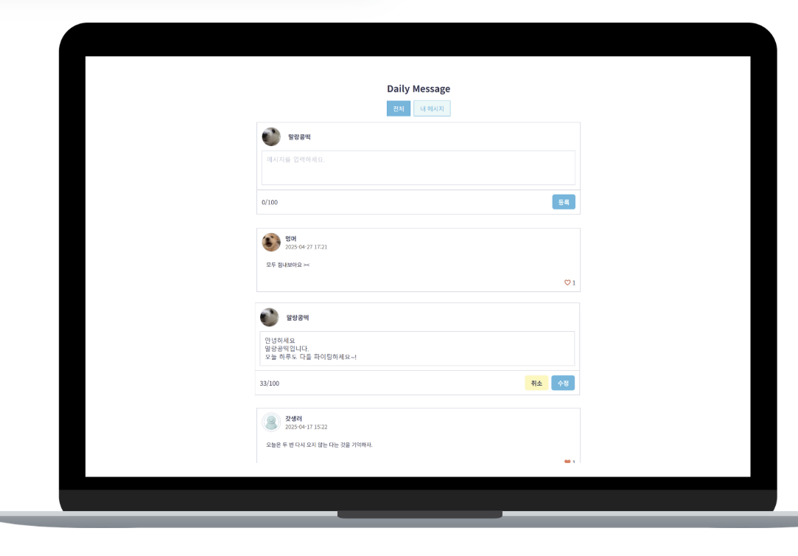
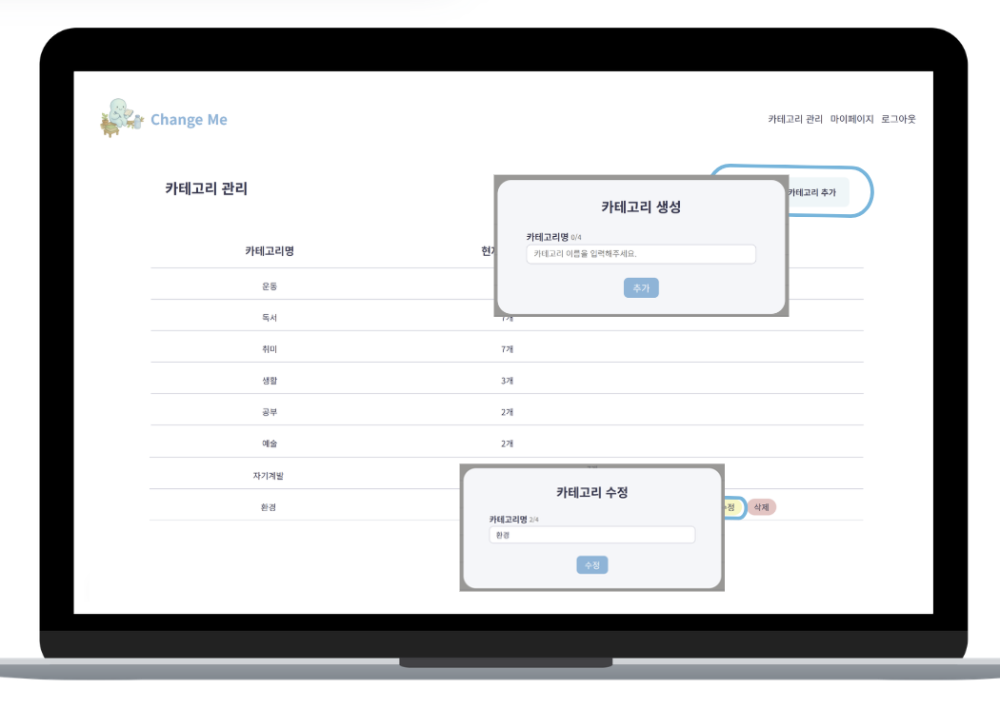
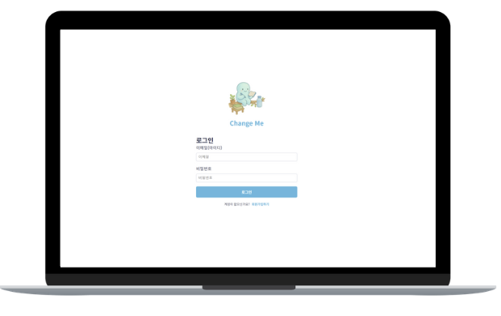
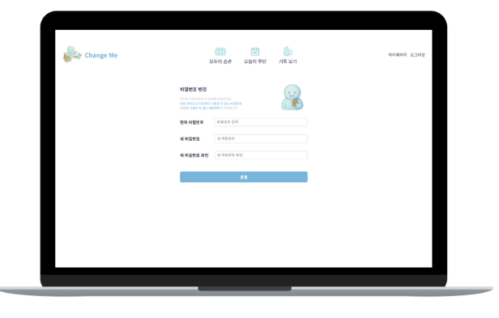
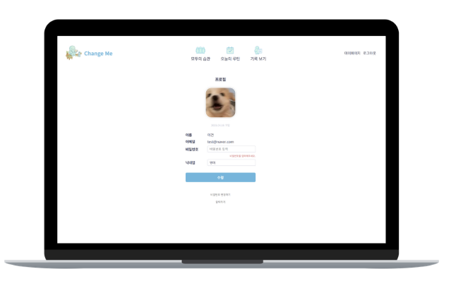

## ✨ ChangeMe
좋은 습관 만들기

"습관 있는 삶"을 위한 루틴 관리 도구입니다.

### 🛠️ 프로젝트 소개
습관을 지속하는 것은 쉽지 않습니다.

ChangeMe는 좋은 습관을 만들어 나가기 위한
계획 + 루틴 + 기록 관리 공간을 제공합니다.

### 📝 기획 의도

하루를 기록하고,

루틴을 반복하고,

목표를 유지할 수 있도록!

### 👨‍👩‍👧‍👦 팀원 소개
| 이름 | 프로필 |
|:---:|:---:|
| **이건** |  |
| **박은지** |  |
| **권우진** |  |
| **박찬우** |  |

## 🖥️ 기술 스택
Next.js, TypeScript, SCSS, Supabase, Zustand, SWR, GitHub, Figma

## 🏗️ 프로젝트 구조 (Clean Architecture 기반)
app/

├── 📂 api/                    # API 구현 
├── 📂 (pages)/                 # 페이지 구성 
├── 📂 application/ 
│   └── 🧩 usecase/             # 비즈니스 로직 흐름 
├── 📂 domain/ 
│   ├── 📄 entities/            # 도메인 엔티티 정의 
│   └── 📄 repositories/        # 데이터 접근 인터페이스 
├── 📂 infra/ 
│   └── 🗄️ repositories/        # Supabase 기반 실제 repository 구현 
├── 📂 stores/                  # 전역 상태 관리 
├── 📂 utils/                   # 공통 유틸 함수 
├── 📂 hooks/                   # 커스텀 훅 
└── 📂 public/                  # 정적 파일 (이미지, 폰트)

## 🌟 주요 기능

| 기능 | 이미지 |
|------|--------|
| **모두의 습관** |  |
| **오늘의 루틴** |  |
| **기록 보기** |  |
| **데일리 메시지** |  |
| **카테고리 관리** |  |
| **회원가입** |  |
| **로그인** |  |
| **비밀번호 변경** |  |
| **마이페이지** |  |

